# interact-solve
とある授業で悩み共有のためのWebアプリケーションが必要になったのでそのために作成中...

## ローカルでの使い方
1. `$ git clone https://github.com/a171413/interact-solve.git`  
（ghqを使っている人は `$ ghq get https://github.com/a171413/inteeract-solve` ）
2. リポジトリ直下に`.env.sample` があるので同階層に複製（ファイル名は`.env`とする）したらポート番号等を指定する 
   PROJECT_NAME=interact-solve 
   DB_PORT=XXXX←お好きにどうぞ 
   APP_PORT=XXXX←お好きにどうぞ 
   DB_NAME=interact-solve
3. `$ cd リポジトリの場所` などでリポジトリのある場所に移動
4. `$ docker compose build` を実行
5. `$ docker compose up` を実行 
    ここでbindについての問題が生じた人はDockerの設定からResources/FILE SHARINGにgitフォルダ（ghqの人はghqフォルダ）を追加してDockerを再起動． 
   その後，プロジェクト/build/libsフォルダを作成すれば解消することが多い

上記でローカルで動作させられるはずです

## デモ画面
### 登録・ログイン〜マイページ
1. m218113.comにアクセスしていただくと下記のような画面になるかと思います
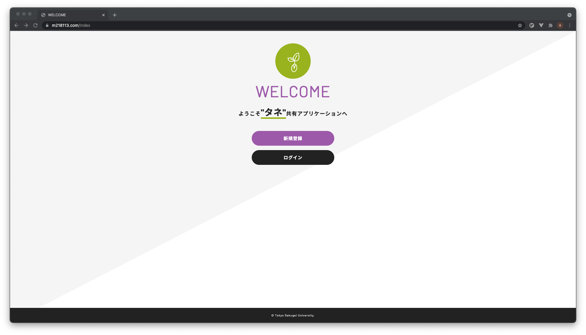
2. 初めて使われる方は"新規登録"のボタンをクリックしていただき，必要情報を入力の上"登録"をクリック
 （既にアカウントをお持ちの方は3へ）
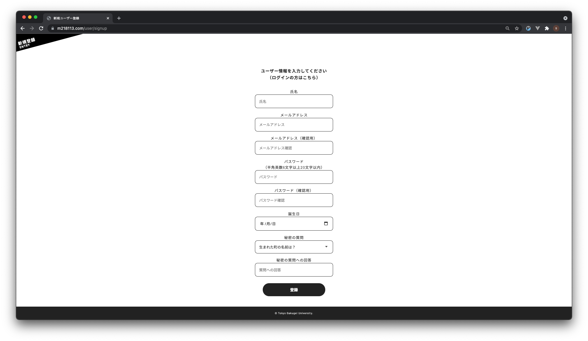
3. ログイン画面ではメールアドレスとパスワードの入力が求められます．必要情報を入力の上"ログイン"をクリック
 （"パスワードをお忘れの方はこちら"の流れについては最下部へ）
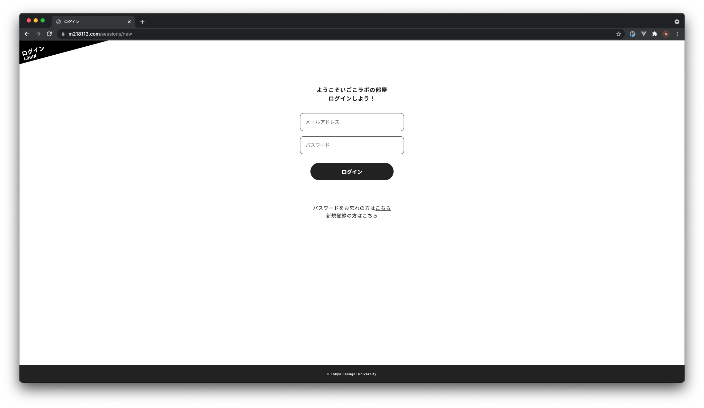
   動作確認のため，テストユーザーを作成しております．以下の情報を入力してください．
   - メールアドレス: test(at)example.com   &nbsp;※(at)はアットマークに置き換えてください
   - パスワード: test0000
4. ログインが完了するとマイページが表示されます

この画面では以下のようなことができる
   1. タネ（悩み）の登録画面へ
   2. タネ一覧画面へ
   3. 入室・入室状態の変更・退室
   4. 入室状況の閲覧
   5. 自身が投稿したタネの閲覧
### タネ登録・閲覧
1. マイページの"タネを登録する"orハンバーガーメニューの"タネを登録"から登録画面へ タイトルに概略を，内容に詳細を入力し，"登録する"
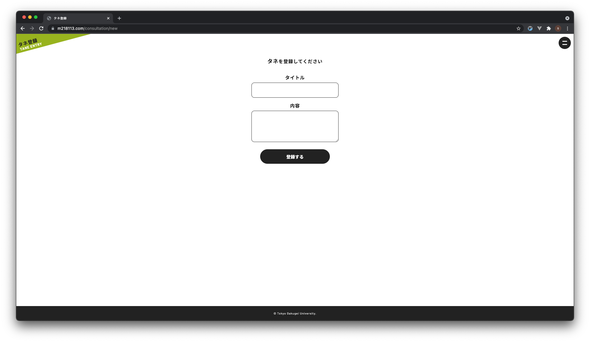
2. 1で登録が完了orマイページで"みんなのタネ一覧を見る"orハンバーガーメニューの"みんなのタネを見る"からタネ一覧画面へ 
   "タネを投稿する"ボタンからタネの登録も可能（1へ遷移）
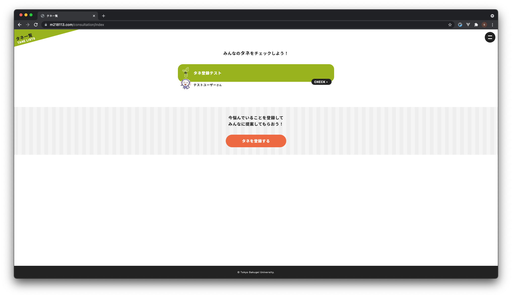
3. タネ一覧画面で"CHECK▶︎"をクリックするとタネ詳細画面へ（ややクリックされたかどうかの判定が怪しいところがあります．今後の改善点とします） 
   この画面では
   - タネのタイトル
   - 誰が投稿したか
   - タネの内容
   - タネに対するこれまでの提案
   
   を見ることができ
   - 新たな提案をする（"こんなのはどうですか？"とあるフォームに提案を入力し，"提案"をクリックすることで提案を登録できる）
   - 提案を行ったユーザーの名前（今回でいえば右下の"テストユーザー"）をクリックするとそのユーザーのページへ遷移する
   といったことができる
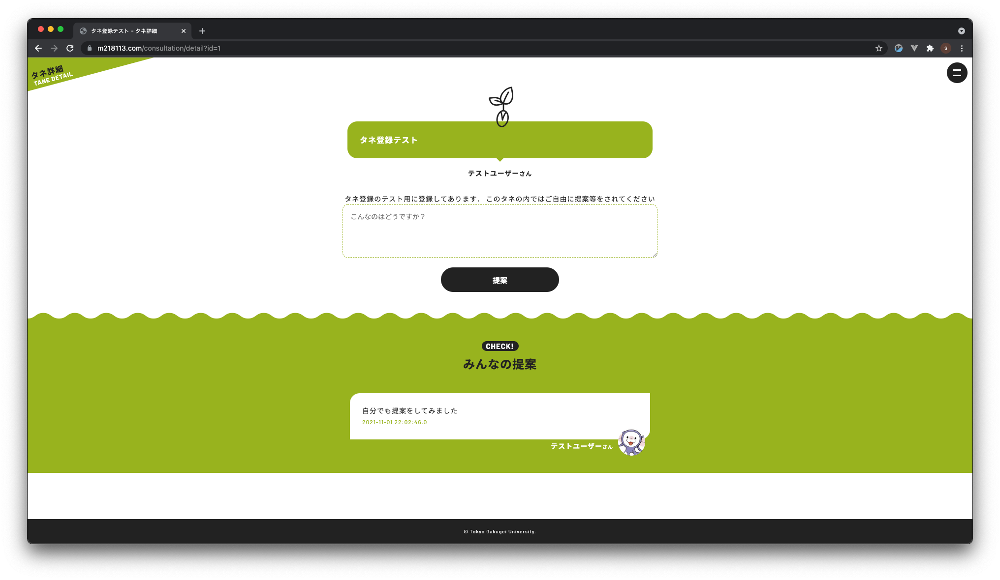

### 入室・入室状態の変更・退室
このWebアプリケーションはある部屋における交流を促進する目的や部屋の雰囲気を遠隔でも把握したいという目的があったため，入室した人がどのような目的で部屋に滞在しているかを管理するため，このような機能を実装した 
1. マイページの"入室する"orハンバーガーメニューの"入室設定"から入室手続き画面へ 
   ここで入室の目的を3つから選択し，"入室する"をクリック
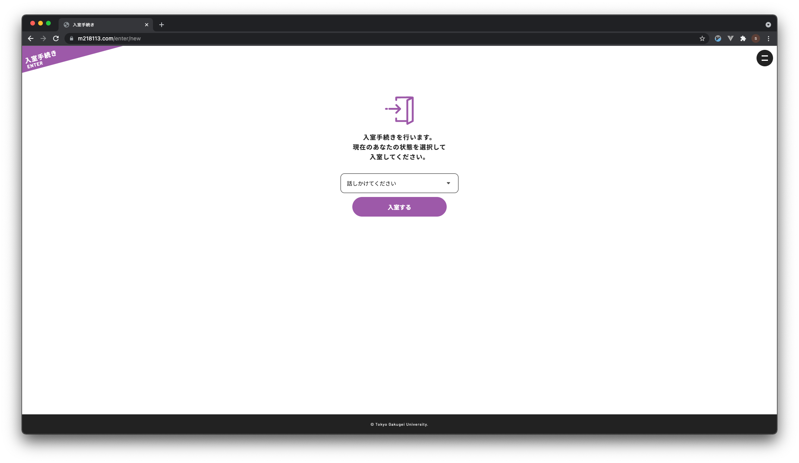
2. 入室手続きが完了するとこのようになる（一番左が0→1人に）
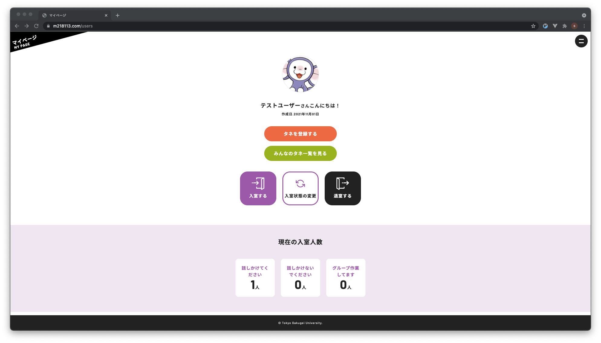
3. 入室中に目的が変わったら，マイページの"入室状態の変更"orハンバーガーメニューの"入室設定"から入室状態変更画面へ 
   1と同様に，入室目的を3つの中から選んで"変更する"をクリック
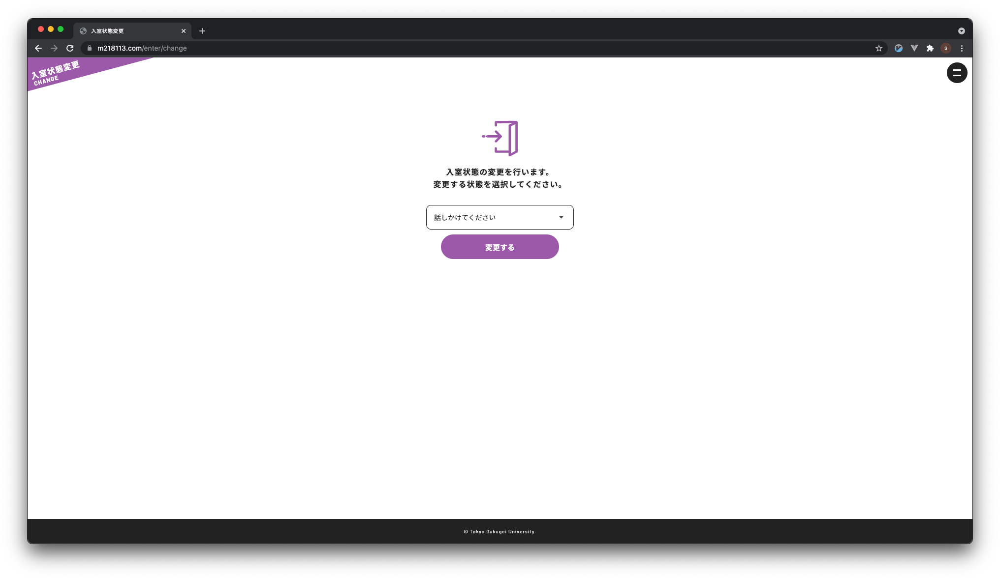
4. 入室状態変更が完了したらこのようになる（一番左が1→0人，真ん中が0→1人に）

5. 退室する際にはマイページの"退室する"orハンバーガーメニューの"退室設定"から退室画面へ 
   本当に退室するかを尋ねられるので"はい"をクリックすれば退室が完了
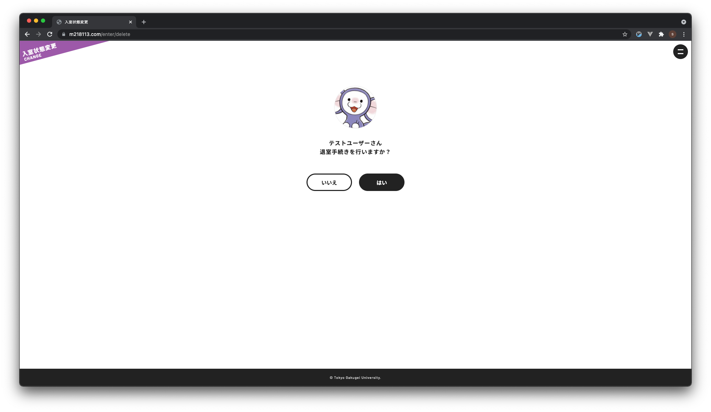
   退室が完了したので真ん中が1→0人になっている
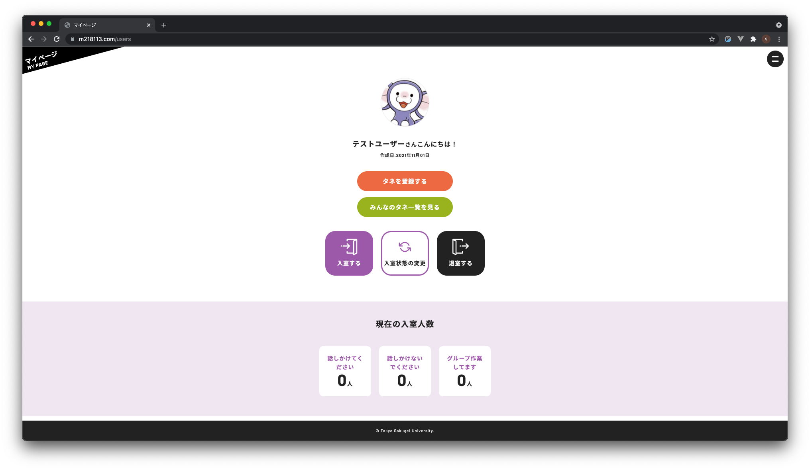
   

### ログアウト
ハンバーガーメニューから"ログアウト"をクリックすることでログアウト画面へ
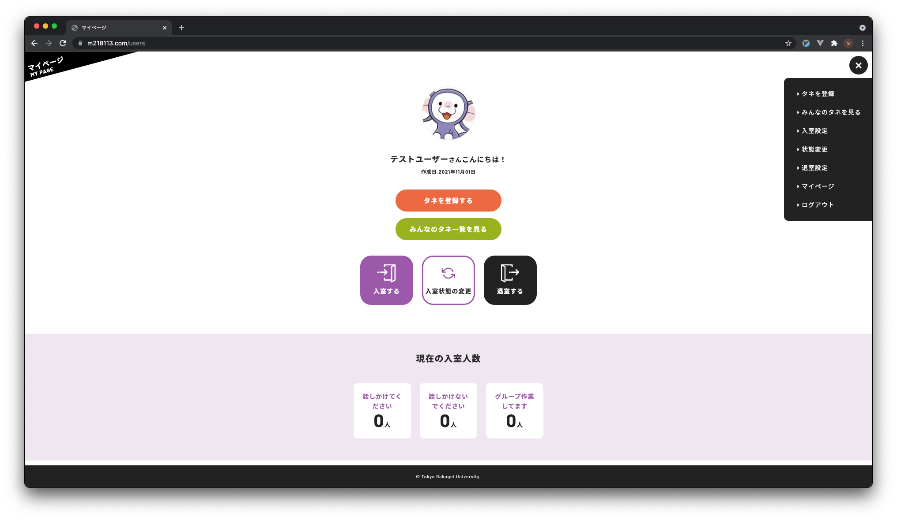
本当にログアウトして大丈夫か尋ねられるので"はい"をクリックするとログアウト完了です
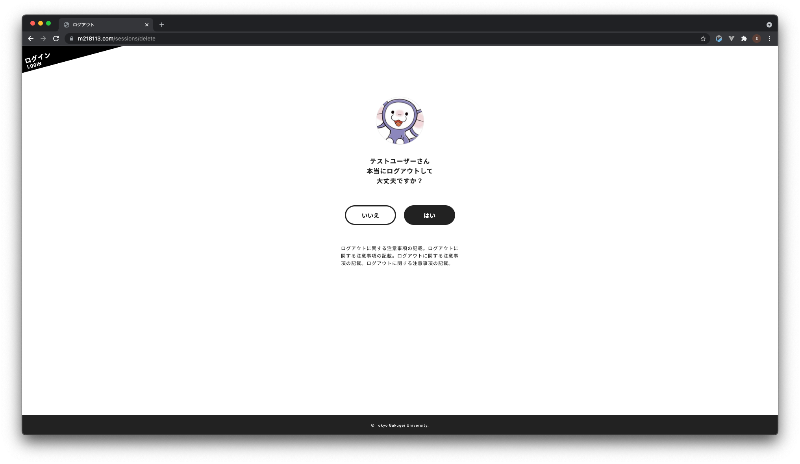

### パスワード再設定
ログイン画面において，パスワードを忘れた人用の手続きを用意している 
1. "パスワードをお忘れの方は<u>こちら</u>"をクリックすると本人確認画面へ

2. 登録したメールアドレスと誕生日を入力し"送信"
3. パスワード再設定画面が出てくるので，秘密の質問への回答と新たなパスワードを入力し"再設定"をクリック
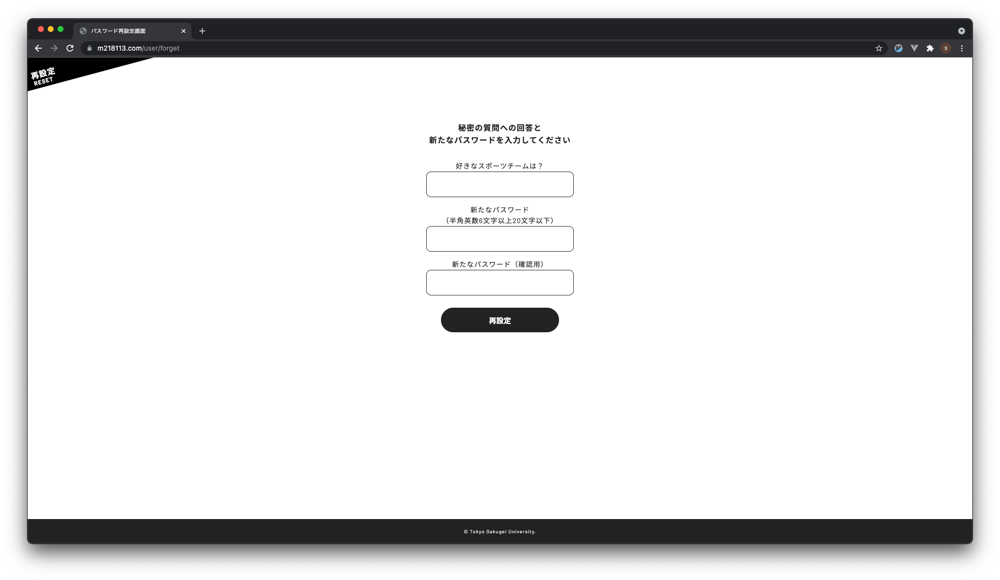
4. 登録が完了するとトップページへ遷移

